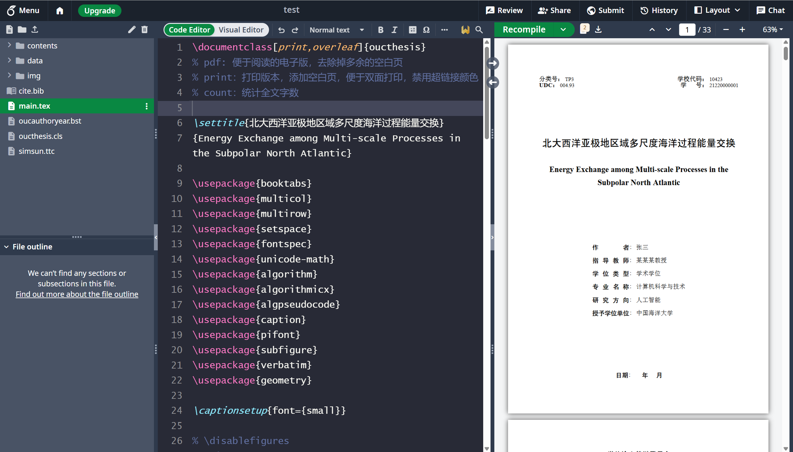
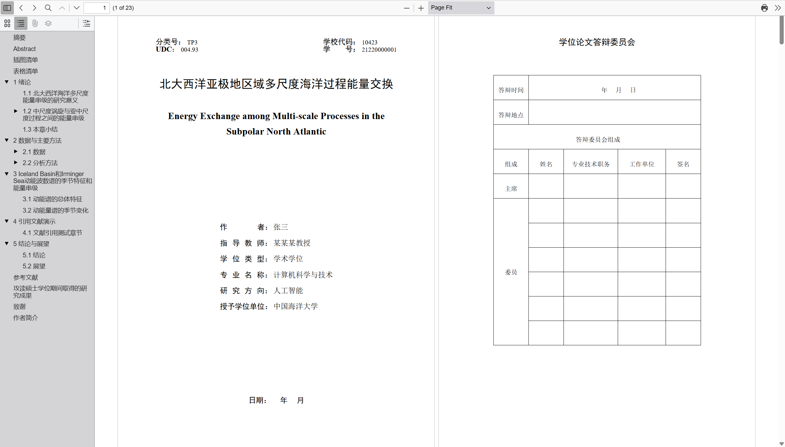

# 中国海洋大学硕士博士学位论文 LaTeX 模板（理工农医类2025版）

本模板是中国海洋大学硕士博士学位论文（理工农医类）LaTeX 模板。
本模板在 [中国海洋大学硕博士学位论文 LaTeX 模板 (2025版)](https://github.com/oucailab/OUC-LaTex-master)
基础上，
根据《中国海洋大学研究生学位论文书写范例（理工农医类）》修改。


原 README 请见 [here](./OLDREADME.md)。

## 使用
### TexPage 在线
直接使用即可。

### Overleaf 在线
Overleaf 缺失宋体，需要手动上传宋体文件到在线项目中。具体操作如下：
1. 从 Windows 系统的 `C:\Windows\Fonts` 目录下将字体文件 `simsun.ttc` 复制到一个目录下，
如桌面中，再将 `simsun.ttc` 从本地上传到 overleaf 在线项目的根目录中。
2. 在 `main.tex` 中添加 `overleaf` 选项：
```tex
\documentclass[print,overleaf]{oucthesis}
```



### Vscode 本地


## 鸣谢
- [中国海洋大学硕博士学位论文 LaTeX 模板 (2025版)](https://github.com/oucailab/OUC-LaTex-master)
- [中国海洋大学硕博士学位论文 LaTeX 模板（overleaf & Texpage版）](https://github.com/summitgao/OUC-LaTex-master)
- [gaofront](https://github.com/gaofront)
- [GeoffreyChen](https://www.geoch.top/)
- [Karthus77](https://github.com/Karthus77)